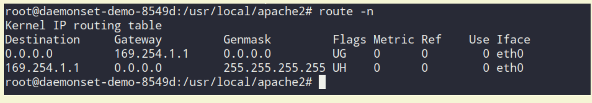

技术002KNetwork

技术002KNetwork
===============

-  `技术002KNetwork <>`__

   -  `基础知识网络 <>`__
   -  `流量控制 <>`__

      -  `传统的流量控制是如何实现的？实现的原理的是什么？ <>`__
      -  `k8s中的流量控制 <>`__

   -  `Kube-Proxy <>`__

      -  `ipvs <>`__

   -  `网络常用工具 <>`__

      -  `tcpdump <>`__
      -  `iperf <>`__
      -  `iproute <>`__
      -  `iptables <>`__
      -  `route <>`__

   -  `网络方案 <>`__
   -  `参考文档 <>`__

基础知识网络
------------

`命名空间 <https://mp.weixin.qq.com/s/lxIy8PqVckFS_npD2vvBYwhttps://docker-k8s-lab.readthedocs.io/en/latest/docker/netns.html>`__

`TCP/IP/ARP/ICMP协议 <https://mp.weixin.qq.com/s/-70w949-R87RSli_j_981A>`__

-  MB/S与MBIT/S概念

Mbit/s意思是 兆比特/秒，俗称:小b,
是指每秒传输的比特位数，即家里使用的10M或50M宽带或者speedtest测速结果再或者Cacti监控看到的带宽峰值就是这个小b的概念。

MB/s意思是
兆字节/秒,俗称:大B，是指每秒传输的字节数量，也是实际下载文件看到的网络速度。
8Mbit/s(运营商网络带宽)=1MB/s(实际文件下载速度)

流量控制
--------

传统的流量控制是如何实现的？实现的原理的是什么？
~~~~~~~~~~~~~~~~~~~~~~~~~~~~~~~~~~~~~~~~~~~~~~~~

`Linux服务器
使用tc命令对网卡流量上下行限速 <https://blog.csdn.net/jack170601/article/details/78840403>`__

`iproute(网卡限速)–使用方法 <https://blog.51cto.com/liuzhengwei521/2083704>`__
`Docker网络隔离初步设想 <https://toutiao.io/posts/gvxrgc/preview>`__
`Tc流量控制 <https://www.jianshu.com/p/4b5cc3845f2c>`__

k8s中的流量控制
~~~~~~~~~~~~~~~

-  network
   policy用来控制pod和pod中的流量的流向，分为同一个namespace和不同的namespace

https://console.bluemix.net/docs/containers/cs_network_policy.html#isolate_services

IBM公有云用的是Calico

-  Calico网络控制方案pre-DNAT

https://console.bluemix.net/docs/containers/cs_network_policy.html#block_ingress

-  方案1:`实现K8S中Pod带宽限制
   Calico/Flanne通过cni的bandwitch来限制 <https://zhuanlan.zhihu.com/p/54988169>`__
-  方案2:`阿里云的插件容器服务里限制应用的带宽 <https://yq.aliyun.com/articles/388097>`__

Kube-Proxy
----------

kube-proxy 是 Kubernetes 部署的关键组件。它的作用是监听 API server 中
service 和 endpoint
的变化情况，并为服务配置负载均衡。它可以以三种模式运行：userspace、iptables
和 IPVS。在这篇文章中，作者将对 iptables 和 IPVS
进行比较，衡量它们在真实微服务环境中的表现，并总结最佳选择策略。https://www.projectcalico.org/comparing-kube-proxy-modes-iptables-or-ipvs/?utm_sq=g4rzfsszs8##

ipvs
~~~~

-  ipvs转发模式 三种转发模式性能从高到低：DR > NAT >FULLNATipvs
-  负载均衡器常用调度算法

● 轮询（Round Robin） ● 加权轮询（Weighted Round Robin） ● 最少连接调度
● 加权最少连接调度

网络常用工具
------------

tcpdump
~~~~~~~

iperf
~~~~~

iproute
~~~~~~~

iptables
~~~~~~~~

route
~~~~~

常用命令：添加路由ip route add 172.16.0.0/12 via 10.136.44.254 dev
eth0https://blog.csdn.net/yuanchao99/article/details/18992567以机器10.103.17.235(默认路由是公网地址)和10.120.4.16(默认路由是内外地址)为例来判断路由的问题：[wangluhui@103-17-235-sh-100-k10
~]$ route -nKernel IP routing
tableDestination     Gateway         Genmask         Flags Metric
Ref    Use
Iface0.0.0.0         220.181.86.126  0.0.0.0         UG    0      0        0
eth110.0.0.0        10.103.23.254   255.0.0.0       UG    0      0        0
eth010.103.16.0     0.0.0.0         255.255.248.0   U     0      0        0
eth0124.243.223.0   0.0.0.0         255.255.255.0   U     0      0        0
eth4169.254.0.0     0.0.0.0         255.255.0.0     U     1002   0        0
eth0172.16.0.0      10.103.23.254   255.240.0.0     UG    0      0        0
eth0172.17.0.0      0.0.0.0         255.255.0.0     U     0      0        0
docker0220.181.86.0    0.0.0.0         255.255.255.128
U     0      0        0
eth1路由匹配该路由表，如果都匹配不到，那么会取第一条数据：0.0.0.0         220.181.86.126  0.0.0.0         UG    0      0        0
eth1，可以看到第一条数据的网关是个外网地址，所以，需要在文件/etc/sysconfig/network-scripts/route-eth0中添加记录172.16.0.0/12
via
10.103.23.254，其中网关10.103.23.254是物理机所在的网关10.120.4.16机器上[wangluhui@120-4-16-SH-1037-B10
~]$ ip routedefault via 10.120.4.254 dev eth010.0.0.0/8 via 10.120.4.254
dev eth010.120.4.0/24 dev eth0  proto kernel  scope link  src
10.120.4.16169.254.0.0/16 dev eth0  scope link  metric 1002

查看网卡是千兆还是万兆ethtool eth0 scp限制速度scp -l
2000这里2000是2M的意思 Route:route -n 查看路由表\ |image0|

根据路由信息，ping
192.168.190.203，会匹配到第一条。第一条路由的意思是：去往任何网段的数据包都发往网管169.254.1.1，然后从eth0网卡发送出去。

路由表中Flags标志的含义：U up表示当前为启动状态H
host表示该路由为一个主机，多为达到数据包的路由G Gateway
表示该路由是一个网关，如果没有说明目的地是直连的D Dynamicaly
表示该路由是重定向报文修改M 表示该路由已被重定向报文修改

网络方案
--------

`k8s
cni <https://thenewstack.io/hackers-guide-kubernetes-networking/>`__

Kubelet invokes the CNI plug-in with environment variables containing
command parameters (CNI_ARGS, CNI_COMMAND, CNI_IFNAME, CNI_NETNS,
CNI_CONTAINERID, CNI_PATH) and streams the json.conf file through stdin.
The plug-in responds with json output text, describing the results and
status. See more detailed explanation and examples here. It’s relatively
simple to develop your own CNI plug-in if you know the Go programming
language, as the framework does much of the magic and you can use or
extend one of the existing plug-ins here.Kubelet will pass the POD name
and namespace as part of the CNI_ARGS variable (for
example  “K8S_POD_NAMESPACE=default;K8S_POD_NAME=mytests-1227152546-vq7kw;”
). We can use this to customize the network configuration per POD or POD
namespace (e.g. put every namespace in a different subnet). Future
Kubernetes versions will treat networks as equal citizens and include
network configuration as part of the POD or namespace spec just like
memory, CPUs and volumes. For the time being, we can use annotations to
store configuration or record POD networking data/state.

参考文档
--------

1.破案：Kubernetes/Docker 上无法解释的连接超时.网络问题排查示例

2.\ `网络篇 Kubernetes
网络故障常见排查方法 <https://mp.weixin.qq.com/s/TrQBrbGZnB4Hus55UZUgxg>`__

3.\ `k8s网络方案比较 <https://itnext.io/benchmark-results-of-kubernetes-network-plugins-cni-over-10gbit-s-network-36475925a560>`__
安装维护/安全/性能/资源消耗

