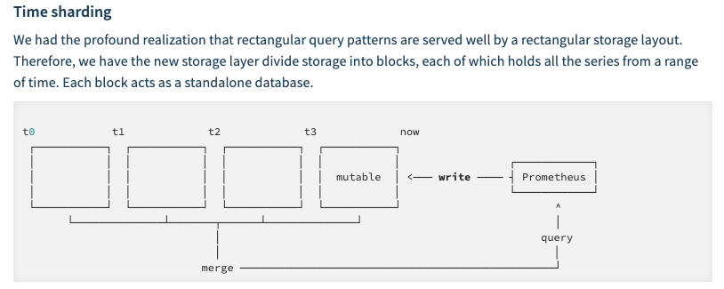
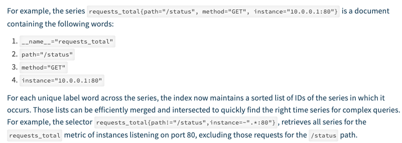

技术002KPromethus

技术002KPromethus
=================

-  `技术002KPromethus <>`__

   -  `参数解读&存储实现原理 <>`__
   -  `容量规划 <>`__
   -  `高可用 <>`__
   -  `报警 <>`__

      -  `钉钉 <>`__

   -  `Trouble <>`__
   -  `参考资料 <>`__

参数解读&存储实现原理
---------------------

1. Time sharding |image0|
2. Index 将指标拆分成倒排索引（inverted index concept） 倒排索引
   |image1|
3. 监控数据在磁盘的存储形式

Prometheus
按照两个小时为一个时间窗口，将两小时内产生的数据存储在一个块（Block）中。每个块都是一个单独的目录，里面含该时间窗口内的所有样本数据（chunks），元数据文件（meta.json）以及索引文件（index）。其中索引文件会将指标名称和标签索引到样板数据的时间序列中。此期间如果通过
API 删除时间序列，删除记录会保存在单独的逻辑文件 tombstone 当中。

当前样本数据所在的块会被直接保存在内存中，不会持久化到磁盘中。为了确保
Prometheus 发生崩溃或重启时能够恢复数据，Prometheus
启动时会通过预写日志（write-ahead-log(WAL)）重新记录，从而恢复数据。预写日志文件保存在
wal 目录中，每个文件大小为 128MB。wal
文件包括还没有被压缩的原始数据，所以比常规的块文件大得多。一般情况下，Prometheus
会保留三个 wal
文件，但如果有些高负载服务器需要保存两个小时以上的原始数据，wal
文件的数量就会大于 3 个。

最初两个小时的块最终会在后台被压缩成更长的块。 [info] 注意

本地存储不可复制，无法构建集群，如果本地磁盘或节点出现故障，存储将无法扩展和迁移。因此我们只能把本地存储视为近期数据的短暂滑动窗口。如果你对数据持久化的要求不是很严格，可以使用本地磁盘存储多达数年的数据。

4. prlimit调整prometheus的fd数目

容量规划
--------

抓取间隔越大，数据越稀疏；抓取间隔越小，监控数据的时间分辨率越高，但所需的存储资源会增多。建议将该值设置在
5s ~ 15s 之间。 1.{{}}可以取自定义的变量,$取环境变量
2.rule的语法检测步骤 go get
github.com/prometheus/prometheus/cmd/promtool promtool check rules
/path/to/example.rules. 3.query curl promql

curl -s
http://10.120.16.13:9090/api/v1/query?query=container_cpu_usage_seconds_total
\| jq

curl http://10.120.16.13:9090/api/v1/targets显示默认的label

https://prometheus.io/docs/prometheus/latest/querying/api/#expression-query-result-formats
通过api来获取prom相关数据信息

4，prom的一些命令参数 从2.0开始
–web.enable-lifecycle允许动态加载prom的配置 if o.EnableLifecycle {
router.Post(“/-/quit”, h.quit) router.Put(“/-/quit”, h.quit)
router.Post(“/-/reload”, h.reload) router.Put(“/-/reload”, h.reload) }
func (h *Handler) quit(w http.ResponseWriter, r*\ http.Request) {
fmt.Fprintf(w, “Requesting termination… Goodbye!”) close(h.quitCh) }
func (h *Handler) reload(w http.ResponseWriter, r*\ http.Request) { rc
:= make(chan error) h.reloadCh <- rc if err := <-rc; err != nil {

http.Error(w, fmt.Sprintf(“failed to reload config: %s”, err),
http.StatusInternalServerError)

} } 5..prometheus
需要两个接口做join操作，可以通过on同一个字段，group_right引入新的字段来实现。
https://github.com/prometheus/prometheus/issues/2670

https://medium.com/@amimahloof/kubernetes-promql-prometheus-cpu-aggregation-walkthrough-2c6fd2f941eb

最终实现公式如下所示：

max(kube_pod_info{namespace=“*n\ *\ **a**\ *\ m\ *\ **e**\ *\ s\ *\ **p**\ *\ a\ *\ **c**\ *\ e*”,\ *p\ *\ **o**\ *\ d*\ = “pod”})
by (namespace,pod,pod_ip) \* on(pod)

group_right(pod_ip) label_replace(

(sum(rate(container_cpu_usage_seconds_total{namespace=“*n\ *\ **a**\ *\ m\ *\ **e**\ *\ s\ *\ **p**\ *\ a\ *\ **c**\ *\ e*”,\ *p\ *\ **o**\ *\ d\ *\ **n\ ​\ a**\ *\ m\ *\ **e\ = “pod”,
container!=“filebeat”}[1m])) by (pod_name)) /
(sum(container_spec_cpu_quota{namespace=“*n\ *\ **a**\ *\ m\ *\ **e**\ *\ s\ *\ **p**\ *\ a\ *\ **c**\ *\ e*”,\ p**\ *\ o\ *\ **d**\ *\ n*\ ​\ *a\ *\ **m**\ *\ e*\ = “pod”,
container!=“filebeat”}) by (pod_name)
/100000)\ *100,“pod”,“1”,“pod_name”,“(.+)”)
max(kube_pod_info{namespace=“namespace”, pod=~“pod”}) by
(namespace,pod,pod_ip)* on(pod) group_right(pod_ip) label_replace(
(sum(container_memory_rss{namespace=“namespace”, pod_name=~“pod”,
container!=“filebeat”}) by(pod_name) /
sum(container_spec_memory_limit_bytes{namespace=“namespace”,
pod_name=~“$pod”, container!=“filebeat”}) by(pod_name) \*
100),“pod”,“$1”,“pod_name”,“(.+)”)

max(kube_pod_info{namespace=“*n\ *\ **a**\ *\ m\ *\ **e**\ *\ s\ *\ **p**\ *\ a\ *\ **c**\ *\ e*”,\ *p\ *\ **o**\ *\ d*\ = “pod”})
by (namespace,pod,pod_ip) \* on(pod)

group_right(pod_ip) label_replace(

rate(container_network_receive_bytes_total{namespace=“*n\ *\ **a**\ *\ m\ *\ **e**\ *\ s\ *\ **p**\ *\ a\ *\ **c**\ *\ e*”,*p\ **o**\ d\ **n\ ​\ a**\ m**e*= “pod”}[1m]),“pod”,“$1”,“pod_name”,“(.+)”)

max(kube_pod_info{namespace=“*n\ *\ **a**\ *\ m\ *\ **e**\ *\ s\ *\ **p**\ *\ a\ *\ **c**\ *\ e*”,\ *p\ *\ **o**\ *\ d*\ = “pod”})
by (namespace,pod,pod_ip) \* on(pod)

group_right(pod_ip) label_replace(

sum(kube_pod_container_resource_limits_cpu_cores{namespace=“*n\ *\ **a**\ *\ m\ *\ **e**\ *\ s\ *\ **p**\ *\ a\ *\ **c**\ *\ e*”,\ *p\ *\ **o**\ *\ d*\ = “pod”,
container!=“filebeat”}) by (pod),“pod”,“$1”,“pod_name”,“(.+)”)

max(kube_pod_info{namespace=“*n\ *\ **a**\ *\ m\ *\ **e**\ *\ s\ *\ **p**\ *\ a\ *\ **c**\ *\ e*”,\ *p\ *\ **o**\ *\ d*\ = “pod”})
by (namespace,pod,pod_ip) \* on(pod)

group_right(pod_ip) label_replace(

sum(kube_pod_container_resource_limits_memory_bytes{namespace=“*n\ *\ **a**\ *\ m\ *\ **e**\ *\ s\ *\ **p**\ *\ a\ *\ **c**\ *\ e*”,\ *p\ *\ **o**\ *\ d*\ = “pod”,
container!=“filebeat”}) by (pod),“pod”,“$1”,“pod_name”,“(.+)”)

指标存放位置 kube

container_cpu_usage_seconds_total{container_name=“POD”,cpu=“total”,,image=“docker2.yidian.com:5000/devops/pause:3.1”,instance=“10.126.53.9”,job=“kubernetes-cadvisor”,name=“k8s_POD_online-feedback-receiver-prod-1-d468dc8c8-9hjh4_dataplatform_033bc899-d2dc-11e9-82c1-1402ec8225a4_0”,namespace=“dataplatform”,pod_name=“online-feedback-receiver-prod-1-d468dc8c8-9hjh4”}

container_name等于POD的是pause容器

高可用
------

https://ylzheng.com/2018/03/17/promethues-ha-deploy/

报警
----

钉钉
~~~~

./prometheus-webhook-dingtalk
–ding.profile=‘webhook1=https://oapi.dingtalk.com/robot/send?access_token=89066027a7c9f112ac9ecb21d716d9a1bd000b3cc42a19453467373593fdfe49’

``curl -l -H "Content-type: application/json" -X POST -d '{"msgtype":"markdown","markdown":{"title":"title","text":"text\n> 监控描述信息\n\n> ###### 告警时间 \n"},"at":{"atMobiles":["18811756877"],"isAtAll":true}}' https://oapi.dingtalk.com/robot/send?access_token=89066027a7c9f112ac9ecb21d716d9a1bd000b3cc42a19453467373593fdfe49 curl 'https://oapi.dingtalk.com/robot/send?access_token=89066027a7c9f112ac9ecb21d716d9a1bd000b3cc42a19453467373593fdfe49' \ -H 'Content-Type: application/json' \ -d '{ "msgtype": "text", "text": { "content": "我就是我, 是不一样的烟火" }, "at": { "atMobiles": [ "18811756877" ], "isAtAll": false } }'``

docker run -p 8060:8060 timonwong/prometheus-webhook-dingtalk:latest
/bin/prometheus-webhook-dingtalk
–ding.profile=‘webhook1=https://oapi.dingtalk.com/robot/send?access_token=89066027a7c9f112ac9ecb21d716d9a1bd000b3cc42a19453467373593fdfe49’

Trouble
-------

promethus内存异常

promethus的的内存消耗大概60G左右，物理机的内存是64G，影响了物理机上的其他业务，平时占用内存就是5.4G，导致内存增加的原因是因为调用remote
write写，remote write提示Error sending samples to remote storage"
count=100 err=“Post http://10.136.160.40:8080/receive: dial tcp
10.136.160.40:8080: connect: connection timed
out”导致内存增加，增加了大概60G

promethus v1可以限制通过一下配置限制内存，v2不可以
–storage.local.target-heap-size=26214400(25G)

storage.local.target-heap-size用来控制heap的大小，由于Prometheus
2.0引入了一个新的存储引擎，所以v1中的-storage.local.*指标都已经被移除了

参考资料
--------

`编写 Prometheus Exporter: 以阿里云 Exporter
为例 <https://mp.weixin.qq.com/s/8ERjwvHX-Z3Pykx1dgy9uA>`__

`Prometheus 监控架构 –
生产级别 <https://mp.weixin.qq.com/s/jCn0vGT5MDknDq4XdcGV0A>`__ `规划
Prometheus 的存储用量 <https://www.jianshu.com/p/93412a925da2>`__

