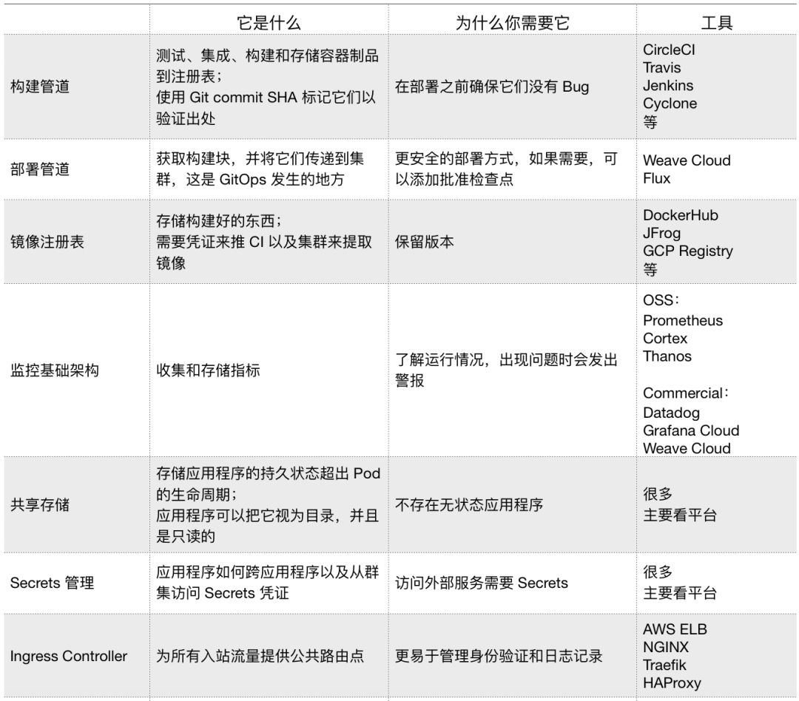

.. role:: raw-latex(raw)
   :format: latex
..

技术002K生产

技术002K生产
============

-  `技术002K生产 <>`__

   -  `环境搭建 <>`__
   -  `生产环境 <>`__
   -  `线上部署应用最佳实践 <>`__
   -  `k8s升级 <>`__
   -  `问题排查手册 <>`__
   -  `其他企业分享 <>`__
   -  `蔚来汽车 <>`__

      -  `ETCD数据备份容灾 <>`__

   -  `k8s集群优化实践 <>`__
   -  `参考文献 <>`__

环境搭建
--------

`kubeadm <https://kubernetes.io/docs/reference/setup-tools/kubeadm/kubeadm/>`__

`Creating Highly Available Clusters with
kubeadm <https://kubernetes.io/docs/setup/production-environment/tools/kubeadm/high-availability/#steps-for-the-first-control-plane-node>`__

`使用 kubeadm 安装最新 Kubernetes 1.15
版本 <https://mp.weixin.qq.com/s/S9OvZa7oW7qo_9m4OznVtA>`__

`kops <https://github.com/kubernetes/kops>`__
`kubespray <https://github.com/kubernetes-sigs/kubespray>`__

生产环境
--------

-  部署方式

https的域名访问是需要认证的，认证是通过dex插件来实现的，协议是oauth2认证
nignx的upstream的后端ip是lvs的ip地址，lvs的后端是通过lvs-controller来控制的

kube-controller-manager和kube-scheduler的选举策略是存放在kube-system命令空间下的Endpoint：kube-scheduler和kube-controller-manager，它们存储leader信息在注解control-plane.alpha.kubernetes.io/leader中

-  网络模式

macvlan

-  日志搜集方案

sidecar注入filebeat->logstash->kafka->log-dump落地（glusterfs）

-  监控

promethus采集数据+ alert-manager警告 + grafana呈现

-  调度器

k8s调度器以及调度器需要考虑的方面
https://mp.weixin.qq.com/s/gfq1qghLW7g4gKZBBP17IA

-  生产环境k8s检查列表

   DAFF1BF2-7934-4FD5-BC01-0FDB36196E23.jpg

-  benchmark

`kubemark-guide <https://github.com/kubernetes/community/blob/452f681d92d98d6d62dfb24fbc9c8da10935632c/contributors/devel/sig-scalability/kubemark-guide.md>`__

线上部署应用最佳实践
--------------------

k8s升级
-------

-  升级步骤

一般遵循先升级 Server，再升级 Client 的做法。对 kubernetes 来说，先升级
kube-apiserver，再升级 controllers，最后灰度升级 kubelet。先升级
kube-apiserver 的原因是 server 是对外提供服务（接口）的，kubernetes
遵循向前兼容两个版本的机制，确保集群的兼容性，最后升级 kubelet
是因为在节点数非常多的情况下，kubelet
的升级需要一个较长的观察周期去灰度。同时提醒大家，一定要注意 kubelet
升级对节点上运行容器的影响。

问题排查手册
------------

-  网络问题
-  网络和磁盘问题 `磁盘 IO 和网络 IO
   该如何评估、监控、性能定位和优化？ <https://mp.weixin.qq.com/s/fCpcAa92-mY2yiRc6BpKqg>`__

其他企业分享
------------

蔚来汽车
--------

ETCD数据备份容灾
~~~~~~~~~~~~~~~~

-  etcd数据备份

   #!/bin/sh

   source /etc/profile nowtime=\ ``date +%Y%m%d%H%M`` # 备份的数据目录
   workdir=“/data/etcd-bak” # etcd的数据目录 datadir=“/data/etcd”
   ep=\ ``/sbin/ip addr|grep eth0|sed -nr 's#^.*inet (.*)/22.*$#\1#gp'``
   capath=“/etc/kubernetes/ssl/ca.pem” certpath=“/etc/etcd/ssl/etcd.pem”
   keypath=“/etc/etcd/ssl/etcd-key.pem”
   etcdctlpath=“–endpoints”https://:math:`{ep}:2379" --cacert=`\ capath
   –cert=\ :math:`certpath --key=`\ keypath" hostname=\ ``hostname``
   alertcontent=“:math:`hostname-etcd-bak-is-false-please-check-etcd-`\ {nowtime}”
   # 备份数据保留天数 delday=7
   s3path=“s3://etcd/etcd-:math:`{ep}"  s3alertcontent="`\ hostname-etcd-snapshot-to-s3-false-please-check”
   etcdctlcmd=\ ``whereis etcdctl|awk '{print $NF}'``

   function deloldbak () { find
   :math:`workdir -name "etcd-*.gz" -mtime +`\ {delday}|xargs rm -f }

   if [ ! -f /data/etcd-bak/etcd-${nowtime}.tar.gz ];then mkdir -p
   /data/etcd-bak/etcd-:math:`{nowtime}/  else  echo "need wait to next time"  echo "need wait to next time" >>`\ workdir/etcd-bak.log
   exit 1 fi

   echo “=================================== begin $nowtime
   ==================================” echo
   “=================================== begin
   :math:`nowtime ==================================" >>`\ workdir/etcd-bak.log
   export ETCDCTL_API=3 echo”=================================== run
   snapshoting ================================="
   >>$workdir/etcd-bak.log $etcdctlcmd $etcdctlpath snapshot save
   :math:`workdir/etcd-`\ {nowtime}/snap-:math:`{nowtime}.db >>`\ workdir/etcd-bak.log
   echo “=================================== run snapshoting
   =================================” >>$workdir/etcd-bak.log if [ $?
   -eq 0 ] then echo “etcd snapshot
   etcd-:math:`{nowtime}/snap-`\ {nowtime}.db is successful” echo “etcd
   snapshot etcd-:math:`{nowtime}/snap-`\ {nowtime}.db is successful”
   >>\ :math:`workdir/etcd-bak.log  else  echo "etcd snapshot etcd-`\ {nowtime}/snap-:math:`{nowtime}.db is failed"  echo "etcd snapshot etcd-`\ {nowtime}/snap-:math:`{nowtime}.db is failed" >>`\ workdir/etcd-bak.log
   fi

   cp -fr $datadir/\* :math:`workdir/etcd-`\ {nowtime}/ if [ $? -eq 0 ]
   then echo “etcd snapshot
   etcd-:math:`{nowtime}/member is successful"  echo "etcd snapshot etcd-`\ {nowtime}/member
   is successful”
   >>\ :math:`workdir/etcd-bak.log  else  echo "etcd snapshot etcd-`\ {nowtime}/member
   is failed" echo "etcd snapshot
   etcd-:math:`{nowtime}/member is failed" >>`\ workdir/etcd-bak.log fi

   $etcdctlcmd $etcdctlpath –write-out=table endpoint status $etcdctlcmd
   :math:`etcdctlpath --write-out=table endpoint status >>`\ workdir/etcd-bak.log

   cd :math:`workdir  tar zcf ./etcd-`\ {nowtime}.tar.gz
   etcd-:math:`{nowtime}  rm -fr etcd-`\ {nowtime} aws s3 cp
   :math:`workdir/etcd-`\ {nowtime}.tar.gz $s3path/ if [ $? -eq 0 ] then
   echo “etcd snapshot s3 is successful” echo “etcd snapshot s3 is
   successful”
   >>\ :math:`workdir/etcd-bak.log  else  echo "etcd snapshot s3 is failed"  echo "etcd snapshot s3 is failed" >>`\ workdir/etcd-bak.log
   fi deloldbak

   echo “=================================== end ``date +%Y%m%d%H%M%S``
   ==================================” echo
   “=================================== end ``date +%Y%m%d%H%M%S``
   ==================================” >>$workdir/etcd-bak.log

-  etcd数据恢复

   #!/bin/bash

   # 使用 etcdctl snapshot restore 生成各个节点的数据

   # 比较关键的变量是 # –data-dir 需要是实际 etcd 运行时的数据目录 #
   –name –initial-advertise-peer-urls 需要用各个节点的配置 #
   –initial-cluster initial-cluster-token 需要和原集群一致 #
   注意http和https区别

   # 无需更改 workdir=/root

   # etcd1,2,3为节点名称 ETCD1,2,3为对应节点ip ETCD_1=1.1.1.1
   ETCD_2=2.2.2.2 ETCD_3=3.3.3.3 etcd1=etcd1 etcd2=etcd2 etcd3=etcd3

   # 同上面一样需要对应设置 arra=(1.1.1.1 2.2.2.2 3.3.3.3) arrb=(etcd1
   etcd2 etcd3)

   # etcd是否使用https tls加密如果使用需要配置证书，若是http请置空此变量
   etcdkey=“–cacert=/etc/kubernetes/ssl/ca.pem
   –cert=/etc/etcd/ssl/etcd.pem –key=/etc/etcd/ssl/etcd-key.pem” #
   恢复数据存放目录，只是用于恢复存放数据，可以随意设置，跟原有的路径没有关系
   etcddatapath=“/root/etcd-recover-data/etcd” # 备份数据根路径
   bakdatapath=“/data/etcd-bak” # 备份数据完整路径
   bakdbpath=“$bakdatapath/etcd-201906161945/snap-201906161945.db” #
   ansible site执行路径 ansiblepath=“/root/etcd-bak-ansible” function
   ansibleoperate () { rm -fr
   $ansiblepath/roles/etcd-bak-ansible/files/*cp -fr $(echo
   $etcddatapath|awk -F “[/]” ‘{print “/”$2“/”$3}’)/*
   $ansiblepath/roles/etcd-bak-ansible/files/ cd $ansiblepath
   ansible-playbook -i hosts site.yaml }

   if [ ! -d $(echo $etcddatapath|awk -F “[/]” ‘{print “/”$2“/”$3}’)
   ];then mkdir -p $(echo $etcddatapath|awk -F “[/]” ‘{print
   “/”$2“/”$3}’) fi

   for i in :math:`{arra[@]}  do  echo -e "\t`\ i:raw-latex:`\c"`
   >>\ :math:`workdir/etcdiplist.log  #echo -e "`\ i" done

   for i in :math:`{arrb[@]}  do  echo -e "\t`\ i:raw-latex:`\c"`
   >>\ :math:`workdir/etcdnamelist.log  #echo -e "`\ i" done

   while true do let cnt++
   etcdiplist=\ ``awk -v column=$cnt '{print $column}' $workdir/etcdiplist.log``
   etcdnamelist=\ ``awk -v column=$cnt '{print $column}' $workdir/etcdnamelist.log``

   ::

        if [ "$etcdiplist" = "" ]
            then
                echo "conf is down will to break"
                break
        fi
       echo $etcdiplist $etcdnamelist
       export ETCDCTL_API=3

   | #
     如果用原有member中的db恢复，由于不存在完整的hash性，需要在下面添加
     –skip-hash-check  跳过hash检查 etcdctl snapshot $etcdkey restore
     :math:`bakdbpath \
      --data-dir=`\ etcddatapath
   | –name $etcdnamelist
   | –initial-cluster
     :math:`{etcd1}=https://`\ {ETCD_1}:2380,\ :math:`{etcd2}=https://`\ {ETCD_2}:2380,\ :math:`{etcd3}=https://`\ {ETCD_3}:2380
   | –initial-cluster-token etcd-cluster-0
   | –initial-advertise-peer-urls https://$etcdiplist:2380 &&
   | mv $etcddatapath $(echo $etcddatapath|awk -F “[/]” ’{print
     “/”$2“/”\ :math:`3}')/etcd_`\ etcdiplist

   ::

       echo "--initial-cluster ${etcd1}=https://${ETCD_1}:2380,${etcd2}=https://${ETCD_2}:2380,${etcd3}=https://${ETCD_3}:2380 "

   done

   rm -f $workdir/etcdiplist.log rm -f $workdir/etcdnamelist.log

   #如果不需要ansible自动恢复集群，需要手动恢复的话请注释以下操作
   ansibleoperate

-  镜像仓库升级

   备份之前先停止老的harbor cd harbor docker-compose down
   备份原来的harbor目录 mv harbor /my_backup_dir/harbor 备份数据库 cp -r
   /data/database /my_backup_dir/ 后续升级镜像下载 docker pull
   goharbor/harbor-migrator:[tag] 升级harbor,cfg或者harbor.yml文件
   docker run -it –rm -v
   ${harbor_cfg}:/harbor-migration/harbor-cfg/harbor.cfg -v
   ${harbor_yml}:/harbor-migration/harbor-cfg-out/harbor.yml
   goharbor/harbor-migrator:[tag] –cfg up
   如果没有yaml文件，低版本理论上只有cfg文件，那就升级cfg文件就可以了
   docker run -it –rm -v
   ${harbor_cfg}:/harbor-migration/harbor-cfg/harbor.cfg
   goharbor/harbor-migrator:[tag] –cfg up 解压新的版本离线包 tar -zxvf
   harbor-offline-installer-v1.7.4.tgz 覆盖harbor.cfg
   把之前升级的harbor.cfg文件或者yml文件拷贝到新版本解压的目录里替换相应的文件
   cd harbor mv harbor.cfg harbor.bak cp /root/harbor-bak/harbor.cfg .
   安装Notary，Clair和Helm Chart服务
   安装之前可以perpare脚本生成下配置文件 ./install.sh –with-notary
   –with-clair –with-chartmuseum 进行查看 docker-compose -f
   ./docker-compose.yml -f ./docker-compose.clair.yml ps
   10.清除旧版本镜像 docker images|grep 1.6.2\| awk ‘{print $3}’\|xargs
   docker rmi

k8s集群优化实践
---------------

Kube-on-kube-Operator 通过Operator来管理集群 1. etcd从v2升级到v3 2.
数据格式转化为protobuf 3. 其他优化 我们在 Kubernetes
的最近三次发布中做出了几十项优化，包括：

-  调度器优化（ 5-10 倍的调度吞吐）
-  优化控制器设计，降低了 controller-manager 的资源消耗

参见：https://github.com/kubernetes/community/blob/master/contributors/devel/controllers.md

-  对 API Server 的部分操作进行优化（转换、深度复制、patch）

降低 API Server 的内存占用（显著的降低了 API 调用的延迟时间） 1.
优化关键技术

服务画像：对应用的CPU、内存、网络、磁盘和网络 I/O
容量和负载画像，了解应用的特征、资源规格和应用类型以及不同时间对资源的真实使用，然后从服务角度和时间维度进行相关性分析，从而进行整体调度和部署优化。

亲和性和互斥性：哪些应用放在一起使整体计算能力比较少而吞吐能力比较高，它们就存在一定亲和性；反之如果应用之间存在资源竞争或相互影响，则它们之间就存在着互斥性。

场景优先：美团点评的业务大都是基本稳定的场景，所以场景划分很有必要。例如一类业务对延迟非常敏感，即使在高峰时刻也不允许有太多的资源竞争产生，这种场景就要避免和减少资源竞争引起的延迟，保证资源充足；一类业务在有些时间段需要的CPU资源可能会突破配置的上限，我们通过CPU
Set化的方式让这类业务共享这部分资源，以便能够突破申请规格的机器资源限制，不仅服务能够获得更高的性能表现，同时也把空闲的资源利用了起来，资源使用率进一步提升。

弹性伸缩：应用部署做到流量预测、自动伸缩、基于规则的高低峰伸缩以及基于机器学习的伸缩机制。
精细化资源调配：基于资源共享和隔离技术做到了精细化的资源调度和分配，例如Numa绑定、任务优先级、CPU
Set化等等。 2. 策略优化
调度策略的主要作用在两方面，一方面是按照既定策略部署目标机器；二是能做到集群资源的排布最优。

亲和性：有调用关系和依赖的应用，或哪些应用放在一起能使整体计算能力比较少、吞吐能力比较高，这些应用间就存在一定亲和性。我们的CPU
Set化即是利用了对CPU的偏好构建应用的亲和性约束，让不同CPU偏好的应用互补。

互斥性：跟亲和性相对，主要是对有竞争关系或业务干扰的应用在调度时尽量分开部署。

应用优先级：应用优先级的划分是为我们解决资源竞争提供了前提。当前当容器发生资源竞争时，我们无法决策究竟应该让谁获得资源，当有了应用优先级的概念后，我们可以做到，在调度层，限制单台宿主机上重要应用的个数，减少单机的资源竞争，也为单机底层解决资源竞争提供可能；在宿主机层，根据应用优先级分配资源，保证重要应用的资源充足，同时也可运行低优先级应用。

打散性：应用的打散主要是为了容灾，在这里分为不同级别的打散。我们提供了不同级别的打散粒度，包括宿主机、Tor、机房、Zone等等。
隔离与独占：这是一类特殊的应用，必须是独立使用一台宿主机或虚拟机隔离环境部署，例如搜索团队的业务。
特殊资源：特殊资源是满足某些业务对GPU、SSD、特殊网卡等特殊硬件需求。 3.
优先满足和保证 API Server 计算资源需求 4. 均衡 API Server 负载 5. 开启
NodeLease Feature Kubelet 会使用 Update Node Status
的方式更新节点心跳，而一次这样的心跳会向 API Server 发送大约 10 KB
数据量。

在大规模场景下，API Server 处理心跳请求是非常大的开销。而开启 NodeLease
之后，Kubelet 会使用非常轻量的 NodeLease 对象 (0.1 KB) 更新请求替换老的
Update Node Status 方式，这大大减轻了 API Server 的负担。在上线
NodeLease 功能之后，集群 API Server 开销的 CPU 大约降低了一半。

6. 修复请求链路中丢失 Context 的场景
7. 优化客户端行为

开发团队强制要求所有客户端使用 Informer 去 List/Watch
资源，并且禁止在处理逻辑里面直接调用 Client 去向 API Server List 资源。

参考文献
--------

-  集群优化篇

`Scalability updates in Kubernetes 1.6: 5,000 node and 150,000 pod
clusters <https://kubernetes.io/blog/2017/03/scalability-updates-in-kubernetes-1-6/>`__

`美团点评Kubernetes集群管理实践 <https://www.tuicool.com/articles/ArUZNzy>`__

`一年时间打造全球最大规模之一的 Kubernetes
集群，蚂蚁金服怎么做到的？ <https://www.infoq.cn/article/8b_w7UEKgoGXOuqpGI8P>`__
