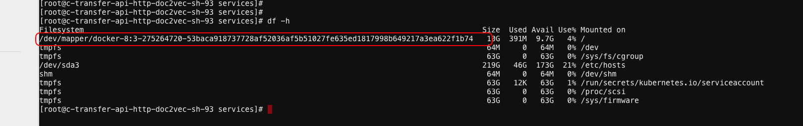

技术002K生产TroubleMaking

技术002K生产TroubleMaking
=========================

-  `技术002K生产TroubleMaking <>`__

线上问题排查记录

1.  k8s连接docker超时Timeout trying to communicate with docker during
    initialization, will retryAug 17 19:32:55 103-35-33-sh-100-C03
    dockerd: http: Accept error: accept unix /var/run/docker.sock:
    accept4: too many open files; retrying in
    1sA：无法重启docker，只能重启机器了

2.  通过强制删除Pod时（–grace-period=0
    –force），注意可能会导致该pod中的容器一直存在物理机上，因此，需要登录到物理机上强制通过docker命令删除掉，但是删除掉这个命令后，如果重新调度到该机器上，会出现问题，因此，通过crictl来删除试试。很可能程序处于D状态卡死了，重启系统。详见文章：Docker
    stop或者Docker
    kill为何不能停止容器 https://mp.weixin.qq.com/s/eZCi73pOFq0sSoMYSVujZw

3.  无法部署新的pod和删除pod解决办法：将node不可调度，然后重启docker即可

4.  Readiness probe errored: rpc error: code = DeadlineExceeded desc =
    context deadline exceeded[10.126.53.8 docker://18.6.1
    3.10.0-327.el7.x86_64]err：Type:Warning Reason:Unhealthy
    Message:Readiness probe errored: rpc error: code = DeadlineExceeded
    desc = context deadline exceeded Type:Warning Reason:Unhealthy
    Message:Readiness probe failed: cannot exec in a stopped state:
    unknown containers with unready status:
    [serving-stgy-rcmdassy-master-132-image] [10.126.53.16
    docker://18.6.1 3.10.0-327.el7.x86_64]-0/130 nodes are available: 1
    node(s) were not ready, 1 node(s) were out of disk space, 14
    Insufficient memory, 31 Insufficient cpu, 97 node(s) didn’t match
    node selector.Readiness probe failed: grpc: the client connection is
    closing: unknown57a62e0c054bfa98677c0016ee1f8 ‘sh
    /home/services/panda/bin/check_port_and_done.sh 7060’ from runtime
    service failed: rpc error: code = DeadlineExceeded desc = context
    deadline
    exceeded好几个服务出现这样的问题，将机器内核从3.10.0-327.el7.x86_64升级至3.10.0-957.el7.x86_64即可。

5.  机器的磁盘空间无法释放。重启机器。

6.  devops.transfer-api-http-doc2vec该服务只用了0.5个CPU，当CPU使用率到达70%，开始出现了502响应7.
    20190903发现物理机的实例和k8s的实例的nginx权重总是一样的，物理机的qps老是降不下来，后来才发现用8台nginx集群中，有一半机器上面的默认路由不存在，无法和容器IP通信，后来添加上默认路由问题就解决了

7.  一个nodejs的服务，分配了一个CPU，在望京机房可以启动，但是在沙河机房启动不了，必须分配8C才能启动。因为程序默认获取系统的CPU，沙河版本是1.11，lxcfs没有起作用，望京版本是1.13.5，lxcfs起作用了，因此，在程序中显式指定程序使用的CPU核数即可。

8.  core-dns有问题，没起来解决方案：镜像拉取不了，镜像地址
    gcr.io/google_containers/k8s-dns-kube-dns-amd64:1.14.1

9.  etcd宕机了解决方案：etcd重启

10. coredns宕了，镜像拉不下来，重启不了

11. calico网络不通解决方案：以下3个网段必须一样kube-apiserver:
    –pod-network-cidrkube-proxy: –cluster-cidrkube-controller-manager:
    –cluster-cidr

12. 在一台物理机上所有的docker容器磁盘大小都是10G解决方案：10.103.32.157,容器中所有的磁盘空间都是10G\ |image0|

docker的配置文件cat daemon.json

::

   {    "authorization-plugins": [],    "data-root": "",    "dns": [],    "dns-opts": [],    "dns-search": [],    "exec-opts": [],    "exec-root": "",    "experimental": false,    "storage-driver": "devicemapper",    "labels": [],    "live-restore": true,    "log-driver": "",    "log-opts": {},    "mtu": 0,    "pidfile": "",    "cluster-store": "",    "cluster-store-opts": {},    "cluster-advertise": "",    "max-concurrent-downloads": 3,    "max-concurrent-uploads": 5,    "default-shm-size": "64M",    "shutdown-timeout": 15,    "debug": false,    "hosts": [],    "log-level": "",    "swarm-default-advertise-addr": "",    "api-cors-header": "",    "selinux-enabled": false,    "userns-remap": "",    "group": "",    "cgroup-parent": "",    "default-ulimits": {},    "init": false,    "init-path": "/usr/bin/docker-init",    "ipv6": false,    "iptables": true,    "ip-forward": false,    "ip-masq": false,    "userland-proxy": false,    "userland-proxy-path": "/usr/bin/docker-proxy",    "ip": "0.0.0.0",    "bridge": "",    "bip": "",    "fixed-cidr": "",    "fixed-cidr-v6": "",    "default-gateway": "",    "default-gateway-v6": "",    "icc": false,    "raw-logs": false,    "allow-nondistributable-artifacts": [],    "registry-mirrors": [],    "seccomp-profile": "",    "insecure-registries": [],    "no-new-privileges": false,    "default-runtime": "runc",    "oom-score-adjust": -500,    "runtimes": {}}

更改配置如下：

::

   {    "authorization-plugins": [],    "data-root": "",    "dns": [],    "dns-opts": [],    "dns-search": [],    "exec-opts": [],    "exec-root": "",    "experimental": false,    "storage-driver": "overlay2",    "storage-opts": [        "overlay2.override_kernel_check=true"    ],    "labels": [],    "live-restore": true,    "log-driver": "",    "log-opts": {},    "mtu": 0,    "pidfile": "",    "cluster-store": "",    "cluster-store-opts": {},    "cluster-advertise": "",    "max-concurrent-downloads": 3,    "max-concurrent-uploads": 5,    "default-shm-size": "64M",    "shutdown-timeout": 15,    "debug": true,    "hosts": [],    "log-level": "info",    "swarm-default-advertise-addr": "",    "api-cors-header": "",    "selinux-enabled": false,    "userns-remap": "",    "group": "",    "cgroup-parent": "",    "default-ulimits": {},    "init": false,    "init-path": "/usr/bin/docker-init",    "ipv6": false,    "iptables": true,    "ip-forward": false,    "ip-masq": false,    "userland-proxy": false,    "userland-proxy-path": "/usr/bin/docker-proxy",    "ip": "0.0.0.0",    "bridge": "",    "bip": "",    "fixed-cidr": "",    "fixed-cidr-v6": "",    "default-gateway": "",    "default-gateway-v6": "",    "icc": false,    "raw-logs": false,    "allow-nondistributable-artifacts": [],    "registry-mirrors": [],    "seccomp-profile": "",    "insecure-registries": [],    "no-new-privileges": false,    "default-runtime": "runc",    "oom-score-adjust": -500,    "runtimes": {}}

更换docker的驱动后并且重启docker即可。

